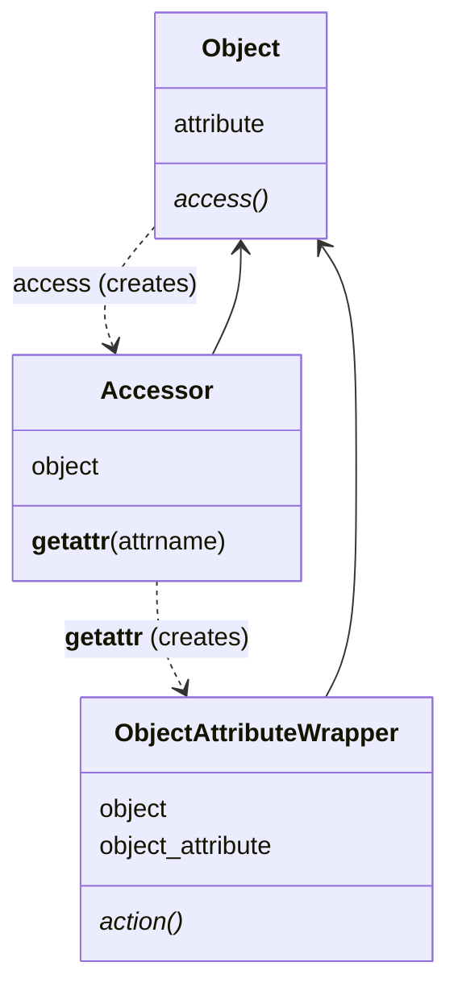
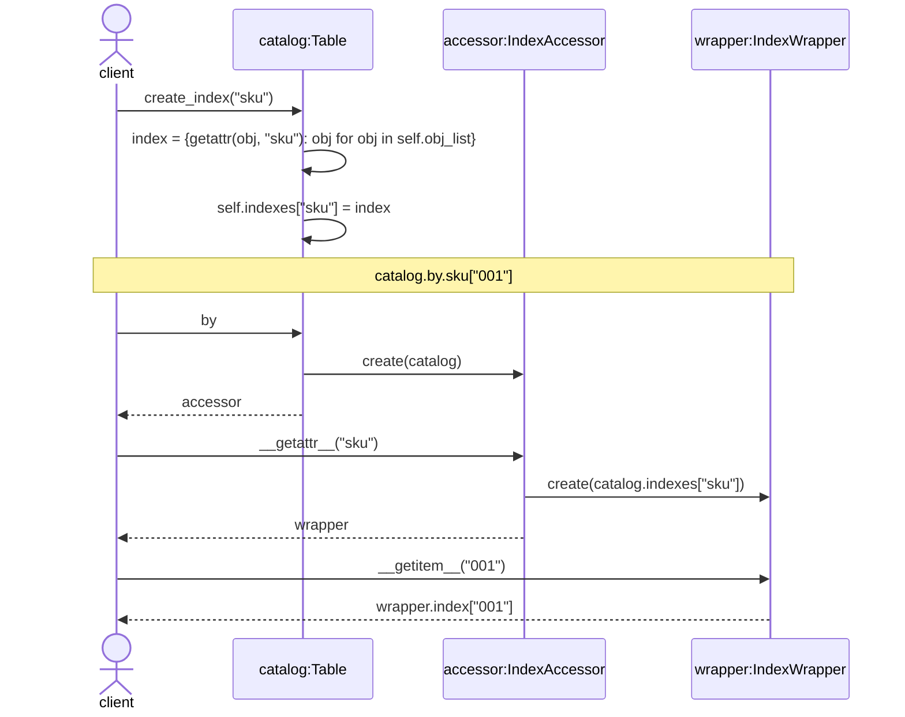

Accessor classes

```mermaid
classDiagram
    
    class Object {
        attribute
        access()*
        }
        
    class Accessor {
        object
        __getattr__(attrname)
        }
    
    class ObjectAttributeWrapper {
        object
        object_attribute
        action()*
        }
    
    Accessor --> Object
    Object ..> Accessor: access (creates)
    Accessor ..> ObjectAttributeWrapper: __getattr__ (creates)
    ObjectAttributeWrapper --> Object
    
    
```

```mermaid
sequenceDiagram
    actor client
    participant tbl as catalog:Table
    participant acc as accessor:IndexAccessor
    participant w as wrapper:IndexWrapper

    client ->> tbl: create_index("sku")
    tbl ->> tbl: index = {getattr(obj, "sku"): obj for obj in self.obj_list}
    tbl ->> tbl: self.indexes["sku"] = index

    note over client,w: catalog.by.sku["001"]

    client ->> tbl: by
    tbl ->> acc: create(catalog)
    tbl -->> client: accessor

    client ->> acc: __getattr__("sku")
    acc ->> w: create(catalog.indexes["sku"])
    acc -->> client: wrapper

    client ->> w: __getitem__("001")
    w -->> client: wrapper.index["001"]

```