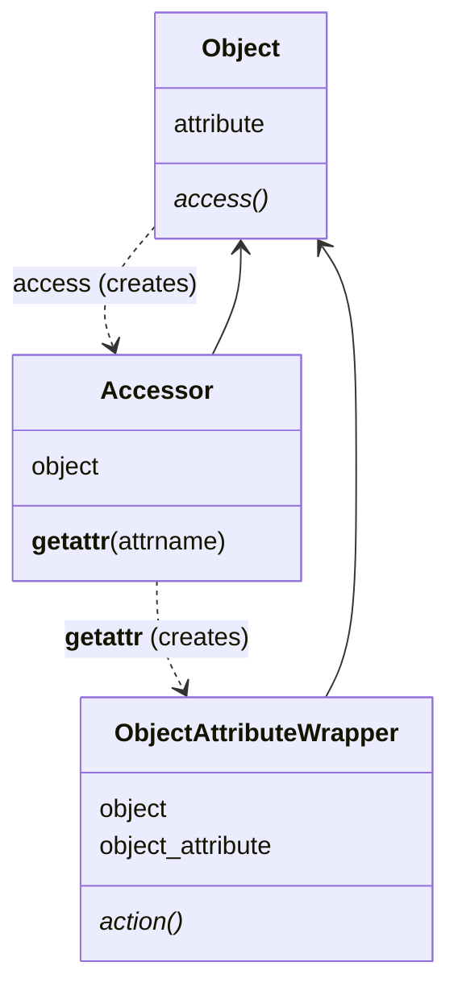
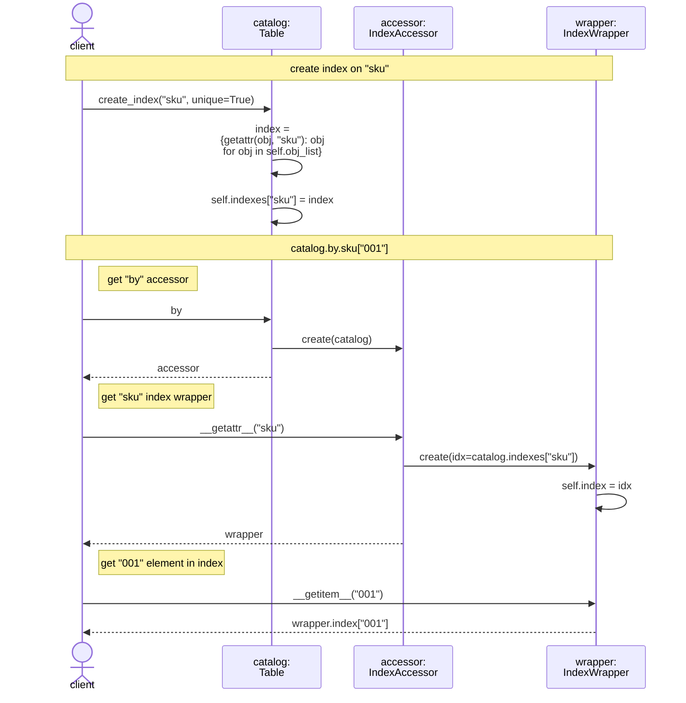

Accessor classes

```mermaid
classDiagram
    
    class Object {
        attribute
        access()*
        }
        
    class Accessor {
        object
        __getattr__(attrname)
        }
    
    class ObjectAttributeWrapper {
        object
        object_attribute
        action()*
        }
    
    Accessor --> Object
    Object ..> Accessor: access (creates)
    Accessor ..> ObjectAttributeWrapper: __getattr__ (creates)
    ObjectAttributeWrapper --> Object
    
    
```

```mermaid
sequenceDiagram
    actor client as client<br>
    participant tbl as catalog:<br>Table
    participant acc as accessor:<br>IndexAccessor
    participant w as wrapper:<br>IndexWrapper

    note over client,w: create index on "sku"

    client ->> tbl: create_index("sku", unique=True)
    tbl ->> tbl: index = <br>{getattr(obj, "sku"): obj<br>for obj in self.obj_list}
    tbl ->> tbl: self.indexes["sku"] = index


    note over client,w: catalog.by.sku["001"]

    note right of client: get "by" accessor
    client ->> tbl: by
    tbl ->> acc: create(catalog)
    tbl -->> client: accessor

    note right of client: get "sku" index wrapper
    client ->> acc: __getattr__("sku")
    acc ->> w: create(idx=catalog.indexes["sku"])
    w ->> w: self.index = idx
    acc -->> client: wrapper

    note right of client: get "001" element in index
    client ->> w: __getitem__("001")
    w -->> client: wrapper.index["001"]

```